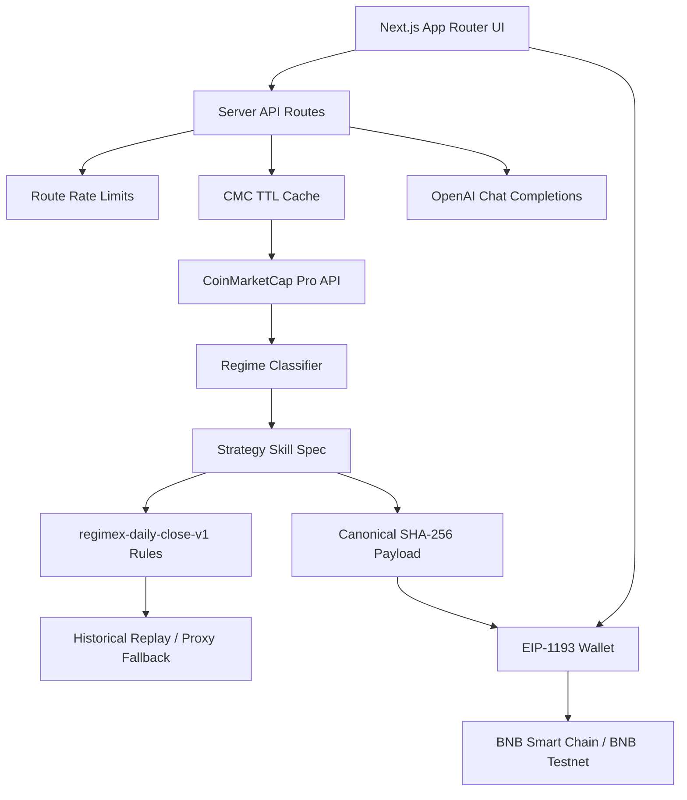

# RegimeX AI

RegimeX AI is a CoinMarketCap-powered Strategy Skills app for BNB Hack Track 2. It detects the current crypto market regime, generates a backtestable strategy specification, explains the reasoning, and creates a reproducible BNB Chain proof hash for the exact strategy artifact.

The app is built for research and verification. It does not custody funds, request trading permissions, or execute live trades.

Production deployment: [https://regimex-ai.vercel.app](https://regimex-ai.vercel.app)

## Track 2 Fit

Track 2 asks builders to ship CMC Skills that generate trading strategies from market data. RegimeX focuses on that deliverable:

- A CMC-backed market regime classifier.
- A deterministic Strategy Skill JSON output.
- Machine-readable backtest rules tied to the generated strategy.
- A historical-first replay flow with an explicit quote-window fallback.
- A canonical SHA-256 proof hash that can be anchored on BNB Smart Chain.
- A portable Skill package page with `SKILL.md`, find-skill manifest, strategy JSON, and canonical hash payload.

## Product Surfaces

- `/` - landing page with app entry points and a lighter mobile visual path.
- `/dashboard` - current regime, confidence, market health, breadth, technical score, liquidity score, and liquid assets.
- `/market-intelligence` - CMC global metrics, movers, sentiment, DEX coverage, and derived signal scores.
- `/strategy-center` - Strategy Skill generator with target asset, horizon, risk mode, and JSON download.
- `/backtesting-lab` - historical CMC replay when available, otherwise an explicit quote-window proxy.
- `/ai-reasoning` - judge-facing AI reasoning grounded in computed CMC signals.
- `/strategy-comparison` - proxy comparison of the four strategy families.
- `/skill-spec` - portable Skill package: markdown workflow, manifest, strategy JSON, and hash payload.
- `/proof` - canonical hash calculation, wallet connection, BNB Chain calldata anchoring, and receipt verification.

## Architecture



## Data Flow

1. `/api/market` fetches CoinMarketCap data server-side through a small TTL cache.
2. `analyzeMarket()` computes breadth, 24h/7d trend, volatility, sentiment, momentum, liquidity, and a derived technical score.
3. `buildStrategySpec()` emits a deterministic Track 2 Strategy Skill artifact with `backtestRules` and `proof.specHash`.
4. `/api/strategy` optionally calls OpenAI for a concise explanation, but keeps claims grounded in supplied CMC-derived fields.
5. `/api/backtest` tries CMC historical quotes first and runs the same `regimex-daily-close-v1` rule engine named in the spec.
6. If historical access is unavailable, the backtest route returns a clearly labeled quote-window proxy derived from live CMC performance fields.
7. `/proof` hashes the canonical strategy payload and sends the hash as zero-value self-transfer calldata on BNB Chain or BNB Testnet.
8. Receipt verification checks transaction success, calldata match, active chain, zero value, sender/recipient self-transfer shape, and connected-wallet context.

## CoinMarketCap Integration

CMC requests are never made from browser code. API keys are read only in server-side modules.

Used CMC endpoints:

- `/v1/cryptocurrency/listings/latest`
- `/v1/global-metrics/quotes/latest`
- `/v3/fear-and-greed/latest`
- `/v1/dex/platform/list`
- `/v3/cryptocurrency/quotes/historical`
- `/v2/cryptocurrency/ohlcv/historical` in the skill contract for OHLCV-capable replay expansion

Signal coverage is explicit in every generated spec:

- `live` signals come directly from successful CMC responses.
- `derived` signals are computed from CMC quote windows, market breadth, volume, and dispersion.
- `missing` signals are shown as missing instead of being fabricated.

Full RSI, MACD, EMA, ATR, derivatives, news, or social/KOL signals are not faked. They are named as future CMC MCP or plan-dependent extensions when unavailable.

## Strategy Spec Contract

Every generated strategy includes:

- `specVersion`
- `id`
- `strategyFingerprint`
- `targetAsset`
- `horizon`
- `regime`
- `confidence`
- `signalCoverage`
- `entryRules`
- `exitRules`
- `riskRules`
- `backtestRules`
- `backtestPlan`
- `proof.specHash`
- `noLiveExecutionNotice`

The strategy fingerprint is stable for the same asset, regime, strategy family, risk mode, horizon, and rule engine. The proof hash is tied to the exact generated artifact and will change if the market snapshot timestamp or any strategy field changes.

## Backtest Rule Engine

Historical replay uses `regimex-daily-close-v1`.

The engine evaluates daily CMC historical quote closes without look-ahead:

- Momentum Rotation: full exposure while trailing 3-day momentum is positive.
- Range Mean Reversion: full exposure after a daily drawdown of at least 1.8 percent, reduced exposure while below the 7-day SMA, flat above the 7-day SMA.
- Defensive DCA: constant reduced exposure to model scheduled accumulation.
- Volatility Breakout: full exposure only when absolute daily move exceeds 2.5 percent and price closes above the 7-day SMA.

The generated `backtestRules` field and the replay code use the same rule definitions.

## BNB Chain Proof

The proof flow is intentionally narrow:

1. Build stable JSON for the strategy spec.
2. Exclude only `proof.specHash` from the hash payload to avoid circular hashing.
3. Compute `SHA-256(canonicalPayload)`.
4. Connect an EIP-1193 wallet.
5. Switch or add BNB Smart Chain Testnet (`0x61`) or BNB Smart Chain Mainnet (`0x38`).
6. Submit a zero-value transaction from the wallet to itself with the hash in `data`.
7. Verify receipt status, calldata, selected chain, zero value, self-transfer shape, and connected-wallet context.

This creates a timestamped proof of the exact strategy artifact without giving RegimeX trade execution permissions.

## Environment Variables

Create `.env` from `.env.example`:

```bash
OPENAI_API_KEY=
COINMARKETCAP_API_KEY=
OPENAI_MODEL=gpt-4o-mini
NEXT_PUBLIC_DEFAULT_CHAIN=bsc-testnet
NEXT_PUBLIC_SITE_URL=http://127.0.0.1:3001
```

Environment details:

- `OPENAI_API_KEY` enables live AI reasoning. Without it, deterministic fallback reasoning is returned.
- `COINMARKETCAP_API_KEY` enables CMC market, sentiment, DEX, and historical quote requests.
- `OPENAI_MODEL` defaults to `gpt-4o-mini`.
- `NEXT_PUBLIC_DEFAULT_CHAIN` supports `bsc-testnet` or `bsc-mainnet`.
- `NEXT_PUBLIC_SITE_URL` is used for canonical metadata, sitemap, and robots output.

Never commit `.env`. It is ignored by `.gitignore` and excluded from Vercel uploads by `.vercelignore`.

## Vercel Deployment

The production project is linked to `nikkus-projects-d0d225f5/regimex-ai`.

Production URL:

```bash
https://regimex-ai.vercel.app
```

Configured Vercel environment variables for Production and Development:

- `OPENAI_API_KEY`
- `COINMARKETCAP_API_KEY`
- `OPENAI_MODEL`
- `NEXT_PUBLIC_DEFAULT_CHAIN`
- `NEXT_PUBLIC_SITE_URL=https://regimex-ai.vercel.app`

Deploy production:

```bash
vercel deploy --prod --yes
```

Preview environment variables require the Vercel project to be connected to a Git repository because Vercel scopes preview envs by branch.

After deploy, smoke-check:

```bash
curl https://regimex-ai.vercel.app
curl https://regimex-ai.vercel.app/manifest.webmanifest
curl https://regimex-ai.vercel.app/robots.txt
curl https://regimex-ai.vercel.app/sitemap.xml
curl https://regimex-ai.vercel.app/api/market
```

## Local Development

Install dependencies:

```bash
corepack pnpm install
```

Run the app:

```bash
corepack pnpm dev --hostname 127.0.0.1 --port 3001
```

Run production locally:

```bash
corepack pnpm build
corepack pnpm start --hostname 127.0.0.1 --port 3001
```

Typecheck:

```bash
corepack pnpm run typecheck
```

Run tests:

```bash
corepack pnpm run test
```

Run the full local gate:

```bash
corepack pnpm run check
```

## API Routes

### `GET /api/market`

Returns:

- source status
- asset quotes
- global metrics
- Fear & Greed if available
- DEX networks if available
- top gainers and losers

Rate limit: 60 requests per minute per client key.

### `POST /api/strategy`

Request:

```json
{
  "symbol": "BNB",
  "riskMode": "balanced",
  "horizon": "30d"
}
```

Returns:

- market snapshot
- computed market pulse
- strategy spec
- AI research note

Rate limit: 12 requests per minute per client key.

### `POST /api/backtest`

Request:

```json
{
  "symbol": "BNB",
  "periodDays": 90,
  "strategy": "Defensive DCA"
}
```

Returns:

- backtest mode: `historical`, `quote-proxy`, or `unavailable`
- equity curve
- return
- win rate
- max drawdown
- Sharpe ratio
- trade count
- coverage notes

Rate limit: 20 requests per minute per client key.

## Production Hardening

- CMC and OpenAI keys stay server-side.
- Browser code calls local API routes only.
- CMC responses use in-process TTL caching to reduce repeated paid API calls.
- Public API routes have basic per-client rate limits and return `429` with `Retry-After`.
- Vercel deployments exclude local `.env` files and use project environment variables.
- Inputs are validated with Zod before strategy generation or backtesting.
- Malformed JSON returns `400` with field-level issues.
- OpenAI responses must parse as JSON before being marked `live`.
- Backtest charts render only returned replay points.
- Historical and proxy backtest modes are clearly labeled.
- The strategy spec includes machine-readable `backtestRules` matching the replay engine.
- Proof verification no longer trusts transaction calldata as the expected hash.
- BNB Chain proof checks receipt status, calldata hash, chain ID, zero value, self-transfer shape, and wallet context.
- `robots.ts`, `sitemap.ts`, `manifest.ts`, Open Graph metadata, and app icons are configured.

## Current Limitations

- CMC historical quotes depend on the active CMC plan. If blocked, RegimeX falls back to a labeled quote-window proxy.
- Strategy comparison still uses the quote-window proxy for fast side-by-side ranking.
- Full RSI, MACD, EMA, ATR, derivatives, news, and social/KOL signals are not fabricated. Add them through CMC MCP, OHLCV, or plan-specific endpoints when available.
- Local in-memory cache and rate limits are good for a demo deployment. For high-traffic production, move rate limiting and cache state to Redis or another shared store.

## Project Files

- `project.md` contains the original product planning notes.
- `lib/regimex/strategy.ts` contains regime analysis, strategy generation, proof hash creation, and backtest rule logic.
- `lib/regimex/cmc.ts` contains CMC API access and response caching.
- `lib/regimex/skill-spec.ts` contains canonical JSON, hash payload, Skill markdown, and manifest generation.
- `components/regimex/proof-client.tsx` contains browser wallet proof anchoring and verification.

## Verification Checklist

Before submitting a demo:

1. Run `corepack pnpm run check`.
2. Open `/dashboard` and confirm CMC source status is `live` or explicitly `partial`.
3. Open `/strategy-center` and generate a Strategy Skill JSON.
4. Open `/skill-spec` and confirm the manifest, markdown, JSON, and hash payload are present.
5. Open `/backtesting-lab` and run a replay. Prefer `historical`; use `quote-proxy` only when CMC plan access blocks history.
6. Open `/proof`, confirm the displayed hash matches `proof.specHash`, anchor on BNB Testnet, and verify the receipt.
7. Confirm `/robots.txt`, `/sitemap.xml`, and `/manifest.webmanifest` resolve in the deployed app.
